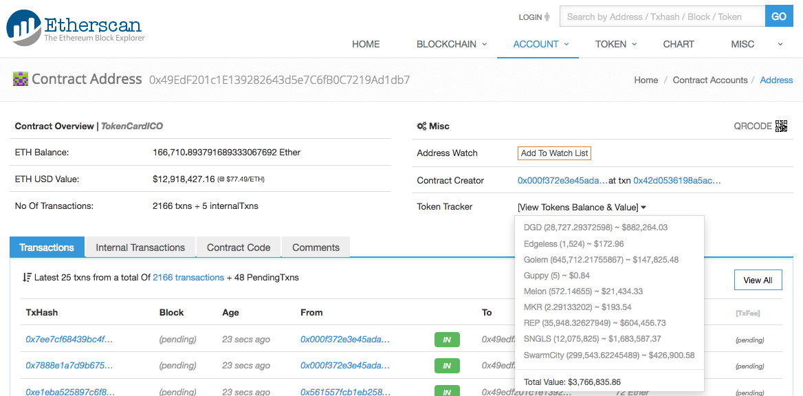

# TokenCard ICO Analysis (Work in progress)

The TokenCard TKN ICO commenced at May-02-2017 04:01:03 PM +UTC and closed 30 minutes 13 seconds later at May-02-2017 04:31:16 PM +UTC.

A total of USD 16,685,263.02 (exchange rate shortly after the closed) was raised, but there were some major bugs in the distribution of the tokens.

The contributions and issued tokens have been reconciled in this report, with the major errors listed below.

TokenCard will have to deploy a new TKN token contract with the correct figures. Individuals who have been sold TKN tokens on the old TKN contract may have lost some ethers in exchange of the worthless old TKN tokens.

 

**Table of contents**
* [Summary](#summary)
* [Details](#details)
  * [Bonus Factor](#bonus-factor)
* [Scripts And Data](#scripts-and-data)
  * [Scripts](#scripts)
  * [Raw Data](#raw-data)
  * [Reconciliation Spreadsheet](#reconciliation-spreadsheet)
* [References](#references)

 

## Summary

 

## Details

ICO Address: [0x49edf201c1e139282643d5e7c6fb0c7219ad1db7](https://etherscan.io/address/0x49edf201c1e139282643d5e7c6fb0c7219ad1db7)

* Funds raised, the USD equivalents at 02:43:04 May 03 2017 AEST just after the ICO closed, and the USD price used in the token crediting computation follows:

      Currency                         Amount  USD Equivalent USD Crediting Rate (1)
      -------- ------------------------------ --------------- ----------------------
      ETH          166,710.893791689333067692   12,918,427.16              75.00
      DGD           28,727.29372598                882,264.03              30.408
      EDG            1,524                             172.96  no credits provided
      GNT          645,712.21755867                147,825.48               0.203
      GUP                5                               0.84  no credits provided
      MLN              572.14655                    21,434.33              36.70
      MKR                2.29133202                    193.54              75.40
      REP           35,948.32627949                604,456.73              16.12
      SNGLS     12,075,825                       1,683,587.37               0.1029
      SWT          299,543.62245489                426,900.58               1.38 
      -------- ------------------------------ --------------- ----------------------
      Total                                     16,685,263.02
      -------- ------------------------------ --------------- ----------------------

TKN Token Address: [0x65b9d9b96bcce0b89d807413e4703d2c7451593a](https://etherscan.io/address/0x65b9d9b96bcce0b89d807413e4703d2c7451593a)

First ICO transaction: [0x7f414c84...](https://etherscan.io/tx/0x7f414c849a74122219a040115d6beab782c7bfefe5ccd66624eb23619aaa0eb5) in block #3638466 at May-02-2017 04:01:03 PM +UTC .

Last non-zero ICO transaction: [0xce7c2a9e...](https://etherscan.io/tx/0xce7c2a9ee12480ced78d4ec940fc8776a872d6455e6acf62de8cbd3b0dd175f6) in block #3638577 at May-02-2017 04:31:16 PM +UTC .

Funding period: 30 minutes 13 seconds

### Bonus Factor

Contributions immediately after the opening of the ICO contract received bonus token amounts (blocks relative to the block the contract opened):
* +50% - 0 - 2 
* +40% - none
* +30% - 2 - 3
* +20% - 3 - 18
* +10% - 10 - 17

 

## Scripts And Data

### Scripts
[scripts/getTKNICOData.sh](scripts/getTKNICOData.sh) extracts the transactions 

### Raw Data

* [results/TKNRAW.xlsx](results/TKNRAW.xlsx) - @tayvano's transaction extract from [TokenCard Tech Roundup and ERC20 Crediting](https://www.reddit.com/r/ethtrader/comments/6933oa/tokencard_tech_roundup_and_erc20_crediting/dh3j6hx/)
* [results/RawData.txt](results/RawData.txt) - Data generated by `getTKNICOData.sh`

### Reconciliation Spreadsheet

[results/TokenCardICODistribution.xlsx](results/TokenCardICODistribution.xlsx)

 

## References

* [TKN Creation Event Updates](https://medium.com/@MonolithStudio/tkn-creation-event-updates-d1390fccf557)
* [Found a major TokenCard ICO token distribution bug](https://www.reddit.com/r/ethtrader/comments/68xui9/found_a_major_tokencard_ico_token_distribution_bug/)
* [TokenCard ICO Page](http://tokencard.io)
* [TKN Token Contract With Errors](https://etherscan.io/address/0x65b9d9b96bcce0b89d807413e4703d2c7451593a)
* [TokenCard ICO Contracts](https://etherscan.io/address/0x49edf201c1e139282643d5e7c6fb0c7219ad1db7)
* [Reddit - TokenCard Tech Roundup and ERC20 Crediting](https://www.reddit.com/r/ethtrader/comments/6933oa/tokencard_tech_roundup_and_erc20_crediting/)
  * (1) [TokenCard Tech Roundup and ERC20 Crediting](http://vessenes.com/tokencard-tech-roundup-and-erc20-crediting/)
* [https://github.com/MonolithDAO/token/tree/master/src](https://github.com/MonolithDAO/token/tree/master/src)

Enjoy. (c) BokkyPooBah / Bok Consulting Pty Ltd 2017
